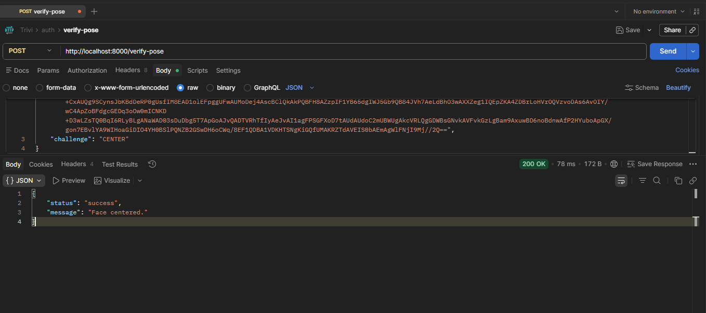

# Liveness-Engine-Py

A high-performance biometric microservice built with **FastAPI** and **Google MediaPipe**. This service provides real-time 3D head-pose estimation to verify user liveness, preventing spoofing attempts in authentication systems.

## Overview

This service acts as the "Intelligence Engine" for biometric verification. By calculating the **Yaw, Pitch, and Roll** of a user's head in 3D space, it ensures that the person interacting with the camera is a living human following real-time instructions, rather than a static photo or a video replay.

## Tech Stack

  - **FastAPI**: Modern, high-performance web framework for Python.
  - **MediaPipe**: Google's cross-platform framework for building multimodal applied machine learning pipelines.
  - **OpenCV**: Open-source computer vision and machine learning software library.
  - **NumPy**: Fundamental package for scientific computing with Python.

## Prerequisites

### 1\. Python Environment

Ensure you have Python 3.9+ installed.

### 2\. MediaPipe Model (Required)

**CRITICAL:** For the biometric engine to function, you must download the pre-trained MediaPipe Face Landmarker model.

1.  Download the `face_landmarker.task` file from the [Official MediaPipe Documentation](https://www.google.com/search?q=https://developers.google.com/mediapipe/solutions/vision/face_landmarker%23models).
2.  Place the file in the root directory of this project.
3.  Ensure the filename matches exactly: `face_landmarker.task`.

##  Installation & Setup

1.  **Clone the repository:**

    ```bash
    git clone https://github.com/alexmuthenya/Liveness-Engine-Py.git
    cd Liveness-Engine-Py
    ```

2.  **Create a virtual environment:**

    ```bash
    python -m venv venv
    source venv/bin/activate  # On Windows: venv\Scripts\activate
    ```

3.  **Install dependencies:**

    ```bash
    pip install -r requirements.txt
    ```

4.  **Run the service:**

    ```bash
    uvicorn main:app --host 0.0.0.0 --port 8000
    ```

## API Endpoints

### `POST /verify-liveness`

Analyzes a facial image against a specific directional challenge.

**Request Body:**

```json
{
  "image": "data:image/jpeg;base64,...",
  "challenge": "LOOK_LEFT"
}
```

**Response:**

```json
{
  "status": "success",
  "message": "Good! Now looking left.",
}
```


## Security Features

  - **3D Pose Estimation**: Uses 468 facial landmarks to calculate head rotation.
  - **Proximity Detection**: Ensures the user is at an optimal distance from the sensor.
  - **Challenge-Response**: Randomly sequence challenges (Center, Left, Right) to defeat replay attacks.
